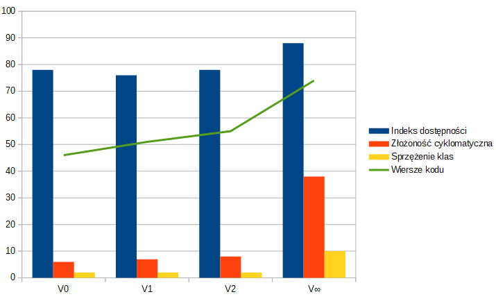

# Refaktoryzacja movie-rental-kata

## Założenia projektu
Kod do refaktoryzacji został napisany w języku C# na podstawie kodu z książki Refaktoryzacja - Ulepszanie struktury istniejącego kodu Martina Fowlera – wydanie pierwsze. 
Celem projektu jest refaktoryzacja kodu, czyli poprawienie jego struktury oraz zastosowanie konwencji przedstawionych w książce.

## Opis programu
Przykładowy program jest bardzo prosty. Jego zadania to:
* Obliczenie i wyświetlenie podsumowania należności klienta wypożyczalni wideo,
* Pobieranie danych na temat wybranych filmów i czasu, na który zostały wypożyczone, 
* system wyznacza punkty stałego klienta, których liczba zależy od tego, czy film należy do kategorii nowości,
* Program sam rozpoznaje typ filmu. Istnieją trzy typy filmów: standardowe, dla dzieci oraz nowości. 

## Klasy programu
* Klasa Movie (film) Movie to prosta klasa pełniąca rolę kontenera danych
* Klasa Rental (pozycja wypożyczona) reprezentuje zdarzenie wypożyczenia filmu przez klienta
* Klasa Customer (klient) reprezentuje klienta wypożyczalni

## Testy
Dla analizowanej sekcji kodu powstał zestaw testów, które mają kluczowe znaczenie w procesie refaktoryzacji kodu – zagwarantują, że podczas tworzenia kolejnych wersji nie popełnię błędu, który wpłynął by na prawidłowe funkcjonowanie programu.
* TestCustomer
* TestAddRental
* TestGetName
* StatementForRegularMovie
* StatementForNewReleaseMovie
* StatementForChildrensMovie
* StatementForManyMovies

## Refaktoryzacja

### Wersja 0
Wersja 0 jest wersją startową, którą poddam dalszym procesom refaktoryzacji.
#### Metryki:
* Indeks dostępności: 78,67
* Złożoność cyklomatyczna: 6,33
* Sprzężenie klas: 2,00
* Wiersze kodu: 46

--- 
### Wersja 1
#### Code Smells:
* Long Method (duże metody)
* Unused parameter (nieużywane parametry)
* Temporary field (pola tymczasowe)
* Feature envy (zazdrość o kod) 

#### Dokonane refaktoryzacje:
* Ekstrakcja metody (Extract Method) :
  * wyciągnięcie instrukcji switch (liczącej cenę) do metody countPrice
  * wyciągnięcie instrukcji zliczających punkty stałego klienta do metody countPoints
* Usunięcie zbędnych parametrów (Remove Parameter)
  * usunięcie thisAmount w metodzie countPrice (przekazywane było 0)
  * usunięcie frequentRenterPoints w metodzie countPoints (w zamian sumujemy zwracane wartości)
* Usunięcie zbędnych pól  (Remove/replace temporary field)
  * zastąpienie inicjacji zmiennej thisAmount wywołaniem metody
* Przeniesienie metody (Move Method)
  * przeniesienie countPoints odpowiadającej za liczenie punktów stałego klienta z klasy Customer do klasy Rental	
  * przeniesienie countPrice odpowiadającej za naliczanie opłaty za wypożyczenie filmu z klasy Customer do klasy Rental	

#### Metryki:
  * Indeks dostępności: 76
  * Złożoność cyklomatyczna: 
  * Sprzężenie klas: 2
  * Wiersze kodu: 51

--- 
### Wersja 2
#### Code Smells:
* Feature envy (zazdrość o kod)
* Duplicated Code (zduplikowany kod)
* Inappropriate Intimacy (niewłaściwa hermetyzacja)
 
#### Dokonane refaktoryzacje:
* Ekstrakcja metody (Extract Method) :
    * wyciągnięcie instrukcji sprawdzającej czy film jest nowością do metody isNewRelease
    * wyciągnięcie zduplikowanej instrukcji obliczającej koszt dla filmu zwykłego i filmu dla dzieci do metody calculatePrice
* Przeniesienie metody (Move Method)
    * przeniesienie metody isNewRelease do klasy Movie
    * przeniesienie ciała metody countPrice oraz ciała metody countPoints z klasy Rental do klasy Movie.
    W klasie Rental zostaje odwołanie do nowo powstałych metod w Movie, gdzie jako parametr będzie przekazywana ilość dni wypożyczenia filmu.
    W ten sposób wszystkie wyliczenia zależne od typu filmu wykonywane są w klasie Movie.
* Zmiana nazw metod oraz zmiennych (Rename Method)
    * nazwy zgodne z konwencją nazewnictwa w programowaniu w C# 
* Enkapsulacja pól i metod
  * Ustawienie właściwych modyfikatorów dostępu

#### Metryki:
* Indeks dostępności: 78
* Złożoność cyklomatyczna: 8
* Sprzężenie klas: 2
* Wiersze kodu: 55

--- 
### Wersja ∞
#### Code Smells:
* Switch Statements (Skomplikowane instrukcje warunkowe)
#### Dokonane refaktoryzacje:
* Wdrożenie wzorca projektowego Stan (Replace Type Code with State):
  * wprowadzenie poziomu pośredniczącego pozwalającego na dziedziczenie z obiektu reprezentującego cenę poprzez
  * dodanie klasy abstrakcyjnej – klasa Price
  * dodanie 3 klas potomnych: RegularPrice, NewReleasePrice i ChildrensPrice
  * modyfikowanie setera klasy Movie - setPriceCode, w taki sposób, aby zmienna price przechowywała właściwy dla danego typu filmu obiekt 
  * przeniesienie ciała metody CountPrice do klasy Price. W klasie Movie zostaje odwołanie do nowo powstałych metod w Price, gdzie jako parametr będzie przekazywana ilość dni wypożyczenia filmu
  * przeniesienie metody CalculatePrice do abstrakcyjnej klasy Price
* Usunięcie switch’a (Replace Conditional with Polymorphism) 
  * zastosowanie polimorfizmu poprzez porozbijanie kodu z instrukcji warunkowych do poszczególnych podklas klasy Price
#### Metryki:
- Indeks dostępności: 88
- Złożoność cyklomatyczna: 38
- Sprzężenie klas: 10
- Wiersze kodu: 74

### Porównanie metryk poszczególnych wersji

Jak widać na powyższym wykresie wszystkie zastosowane przeze mnie metody refaktoryzacji spowodowały powstanie coraz to lepszego kodu, który jest prostszy w zrozumieniu i w dalszym rozwijaniu. 